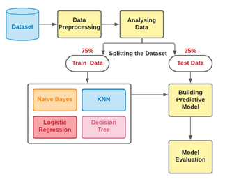
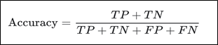
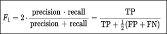

# Methodology 

The aim of this machine learning project is to perform a comparative analysis of various machine learning algorithms and come up with a classification model that can predict fraudulent credit card transactions with high accuracy and efficiency. We start with importing the data set followed by data preprocessing  and then splitting the dataset into train data (75%) and test data (25%). In our project, we implement four machine learning algorithms namely **Logistic Regression**, **K Nearest Neighbour** , **Naive Bayes** and **Decision Tree**. 

Figure 1 shows the proposed methodology of the project.

To evaluate the prediction models, we use three evaluation methods: 

1. Accuracy Score: Accuracy is the fraction of predictions our model got right
    
    
    
2. F1 Score : F1 Score is the weighted average of Precision and Recall.
   
   
    
3. ROC Curve/AUC : A ROC curve (Receiver Operating Characteristic curve) is a graph showing the performance of a classification model. This curve plots two parameters: True Positive Rate and False Positive Rate. The area under the ROC curve (AUC) which represents a common area of true positive rate and false positive rate is used for evaluation.

