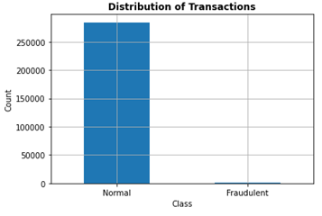
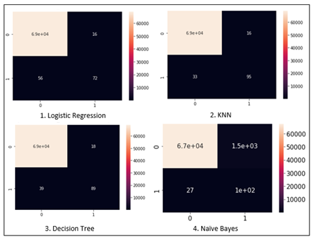
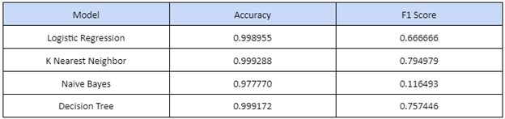
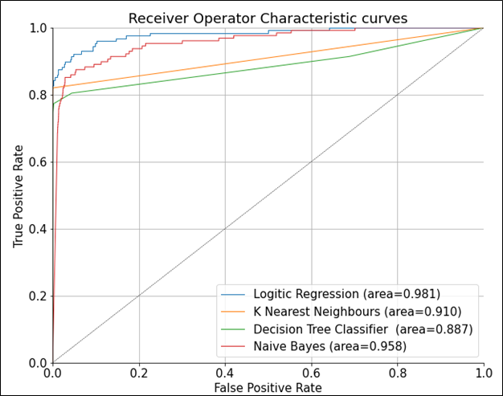

# Results

## I.Exploratory Data Analysis

Figure 1 depicts the distribution of the class variable in terms of Normal and Fraudulent transactions. The graph shows that only 492 out of 284807 transactions are fraudulent. This means that the dataset is highly unbalanced with only 0.17% of transactions being fraudulent. 

## II. Machine Learning Analysis 

The following figure is the confusion matrix obtained after implementing various classification algorithms.

From the confusion matrix, we calculate the accuracy score and F1 score which can be used to evaluate the models. Table 1 provides a summary of the comparative analysis of the various predictive models based on the evaluation metrics.

The following figure shows the Receiver Operating Characteristic (ROC) curve of the  prediction models.

Based on the results presented in the table and the AUC value, we can conclude that **K Nearest Neighbor** is the most effective model with an accuracy of **99.9288%** and F1 score of **0.794979** and thus can be used for the effective prediction of credit card fraud.
